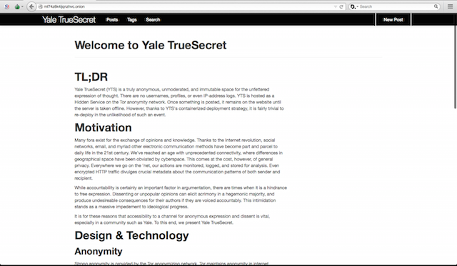

# TL;DR
Yale TrueSecret (YTS) is a truly anonymous, unmoderated, and immutable space for the unfettered expression of thought. There are no usernames, profiles, or even IP-address logs. YTS is hosted as a Hidden Service on the Tor anonymity network. Once something is posted, it remains on the website until the server is taken offline. However, thanks to YTS's containerized deployment strategy, it is fairly trivial to re-deploy in the unlikelihood of such an event.

# Motivation
Many fora exist for the exchange of opinions and knowledge. Thanks to the Internet revolution, social networks, email, and myriad other electronic communication methods have become part and parcel to daily life in the 21st century. We've reached an age with unprecedented connectivity, where differences in geographical space have been obviated by cyberspace. This comes at the cost, however, of general privacy. Everywhere we go on the 'net, our actions are monitored, logged, and stored for analysis. Even encrypted HTTP traffic divulges crucial metadata about the communication patterns of both sender and recipient. 

While accountability is certainly an important factor in argumentation, there are times when it is a hindrance to free expression. Dissenting or unpopular opinions can elicit acrimony in a hegemonic majority, and produce undesireable consequences for their authors if they are voiced accountably. This intimidation stands as a massive impedement to ideological progress. 

It is for these reasons that accessibility to a channel for anonymous expression and dissent is vital, especially in a community such as Yale. To this end, we present Yale TrueSecret.

# Design & Technology
## Anonymity
Strong anonymity is provided by the Tor anonymizing network. Tor maintains anonymity in internet communications through a process called "onion routing" whereby data packets are encrypted thrice-over and bounced around between at least 3 servers, all over the globe, between sender and receiver. This method allows a person to visit a website nearly identically to how they would normally, but instead of divulging their geographyically- and personally-identifying IP address to the website operator, only the IP address of the last "hop" (known as the "exit node") in the chain of Tor relays (known as a "circuit") is revealed. 

Such a scheme allows users to visit websites with total anonymity (assuming the site doesn't require some sort of authentication programatically), but in this model, the service hosting the website is necessarily identifiable because of the Domain Name System (DNS). The DNS can be thought of as the Internet's atlas, providing routing information to a particular destination. 

Thankfully, Tor has an answer to this as well, known as the Hidden Service Protocol. Tor Hidden Services (THS) are located via a `.onion` address, and are masked by the same IP address obfuscation techniques that mask client computers in the regualr Tor network. More information on the Hidden Service Protocol can be found [here](https://www.torproject.org/docs/hidden-services.html.en).

## Website
Yale TrueSecret is a minimal application written in [Python]() using the [Flask]() framework. It is what is known as a "static site generator", which means that at its core, it does little more than store files that users create and produce them upon request. It does this without any need for a database, instead just writing them to disk on the host machine, and reading and serving them at the user's behest. The code behind YTS is a mutt of open-source projects thrown together and built on top of one another, but its closest relative is the Python Flask wiki app [created by Alexander Jung-Loddenkemper](https://github.com/alexex/wiki), which I forked and modified extensively. All of the code for Yale TrueSecret, as well as all of the deployment and configuration scripts, can be found [here](https://github.com/WillChilds-Klein/cpsc185-final)

## Deployment
Yale TrueSecret is deployed using [Docker]() containers on a [DigitalOcean]()virtual private server (VPS). Sometimes referred to as "lightweight virtual machines", containers are essentially process sandboxes based on the [linux container]() specification, a part of most contemporary linux kernel distributions. Containers are advantageous in the deployment of a system such as this becuase they are inherently portable across *just about any* server configuration. Moreover, Docker has provided the tooling around its containers to allow administrators to version, move, and redeploy their "containerized" applicaitons. This is handy because setting up massively distributed backups becomes almost trivial. And should some 3-letter agency come a'knocking on your VPS provider's door and take the site down, just set up a new VPS instance and run the `launch.sh` script provided with Yale TrueSecret, and the service will be back up within a matter of minutes.

# Future Work
[Tor2web]() has been fairly finnicky as of late. I haven't been able to get it to work on either Chrome or Safari browsers. This is quite a shame, because it would greatly facilitate access. However, It is not a complicated technology, and wouldn't be too dificult to re-implement for the purposes of mirroring Yale TrueSecret. Tor2web is nothing more than a proxy server, one end of which accepts user requests from its DNS (read: normal internet) address while the other is connected to the Tor network. The service fetches a user's desired hidden service (*any* `.onion` address) page from the Tor network and relays the content back over the normal connection to the user. For our purposes, we would only have to connect to *one* hidden service. It could probably be implemented without writing any actual code, instead just configuring a standard webserver or proxy to fetch content from Yale TrueSecret.

# How To Access
Yale TrueSecret can be easily accessed as a [Tor Hidden Service](https://www.torproject.org/docs/hidden-services.html.en). As such, it requires downloading the Tor Browser, which will get you up and running with Tor in no time. The Browser can run on either [Mac](https://www.torproject.org/dist/torbrowser/4.5/TorBrowser-4.5-osx64_en-US.dmg), [Windows](https://www.torproject.org/dist/torbrowser/4.5/torbrowser-install-4.5_en-US.exe), or of course [Linux](https://www.torproject.org/dist/torbrowser/4.5/tor-browser-linux32-4.5_en-US.tar.xz). 

Once you have installed the Tor Browswer, just enter `o2uk6vm2grzzcxfj.onion` into the navigation field, and you will find yourself at Yale TrueSecret momentarily.
